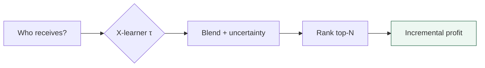

# iFood Coupons Uplift

**Coupon allocation by incremental profit** — X-learner · blend · offline proof on holdout

[](https://www.python.org/)
[](https://spark.apache.org/)
[](https://github.com/uber/causalml)
[](https://docs.astral.sh/uv/)
[](https://caio-olubini.github.io/ifood-coupons-uplift/)

## Simulator

[](https://caio-olubini.github.io/ifood-coupons-uplift/)

**[Open the simulator →](https://caio-olubini.github.io/ifood-coupons-uplift/)** — set budget, compare strategies, export CSV · [`simulator/README.md`](simulator/README.md)

---


## Results (holdout)

20,412 sends · **BlendedUpliftModel** (dynamic λ, γ = 1.0) · model never trained on this split.


| Budget | Random | Raw conversion | **Blend γ = 1.0** |
|---:|---:|---:|---:|
| 1,000 | 1,557 | **4,010** | 2,814 |
| 5,000 | 9,667 | 10,983 | **12,036** |
| 10,000 | 17,820 | 19,613 | **24,244** |
| 15,000 | 25,934 | 23,929 | **32,079** |

| Metric | Value |
|---|---|
| Incremental profit @ 15k | **R$ 32,079** |
| vs random | **+24%** |
| vs raw conversion | **+34%** |
| Qini / AUUC | **0.069 / 0.073** |
| Placebo test | **p = 0/20** |



## What was built

- [x] **Spark pipeline** — extraction, cleaning, attribution, leakage-free features, G1–G10 contract
- [x] **EDA** — funnels, covariate balance, causal diagnostics
- [x] **X-learner** — CATE per offer type; placebo confirms real signal
- [x] **Uncertainty blend** — uplift + conversion prior; dynamic λ by CATE confidence
- [x] **Exploration** — softmax temperature (CLI + simulator)
- [x] **Holdout eval** — Qini/AUUC + incremental profit curves
- [x] **Feature importance** — causal, predictive, combined
- [x] **Test suite** — ~36 tests encoding structural guarantees
- [x] **Spec-driven dev** — `specification/` reqs + acceptance criteria
- [x] **Product** — CLI + allocation simulator

## Quick start

```bash
git clone https://github.com/caio-olubini/ifood-coupons-uplift.git && cd ifood-coupons-uplift
uv sync
uv run coupons-uplift pipeline
uv run coupons-uplift train
uv run coupons-uplift predict --budget 15000 --out campanha.csv
```

`UV` · Python ≥ 3.12 · JDK 11+ · raw data in `data/raw/` · model in `models/`

## Notebooks

| Notebook | Content |
|---|---|
| [`1_data_processing`](notebooks/1_data_processing.ipynb) | Pipeline audit, G1–G10 |
| [`1_1_exploratory_analysis`](notebooks/1_1_exploratory_analysis.ipynb) | EDA, funnels, balance |
| [`1_2_clustering`](notebooks/1_2_clustering.ipynb) | Segmentation *(in progress)* |
| [`2_modeling`](notebooks/2_modeling.ipynb) | X-learner, placebo, blends, gain curves |

## Assumptions

[`specification/00-clarify.md`](specification/00-clarify.md) · key points:

| Topic | Choice |
|---|---|
| Send | RCT — propensity known |
| Treatment | Viewed offer vs received-but-not-viewed (pseudo-control) |
| Label | Conversion in validity window, independent of view (G3) |
| Eval | Observed counterfactual on holdout (Qini-style) |

Divergences logged: 56.7% overlapping receipts · 13.4% right-censored · 25.8% completed without view.

## Limitations

- Promo-window outcome only — no LTV or long-term behavior
- Last wave censored; blend λ/γ tuned on holdout (optimistic)
- Simulator projects from model scores, not realized counterfactuals
- Viewing not randomized — confounding possible
- Offline proof ≠ live A/B

## Roadmap

- [ ] Persona clustering + simulator filter by segment
- [ ] MLflow tracking hardening
- [ ] Databricks integration (deferred — local PySpark for now)
- [ ] Hyperparameter tuning at production scale

---

**[Simulator](https://caio-olubini.github.io/ifood-coupons-uplift/)** · [`simulator/README.md`](simulator/README.md) · [`specification/`](specification/)
