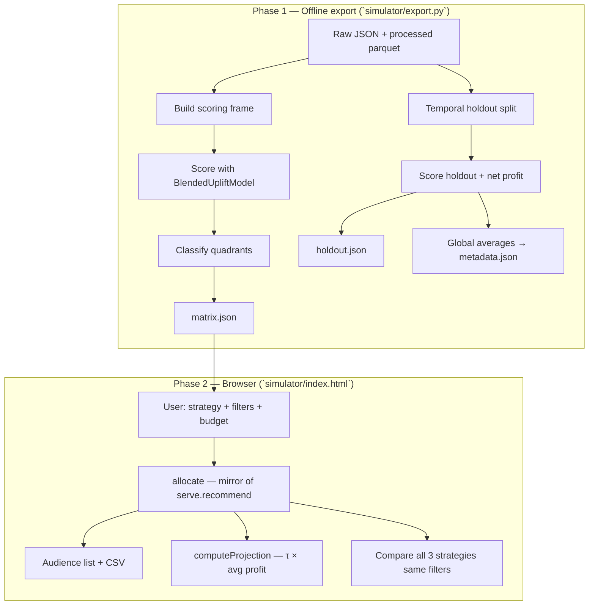

# Coupon Allocation Simulator — iFood

Static interface that answers, for a budget of N coupons: **who to send to, which
offer to assign, and how much it should return** — with a forward projection for the
chosen campaign and a side-by-side comparison of all three ranking strategies under
the same filters and budget.

There is **no backend at runtime**. Everything the UI needs is pre-computed offline
and shipped as JSON; the browser only filters, ranks, and aggregates.

---

## Prerequisites

- [UV](https://docs.astral.sh/uv/) installed
- Processed data and a trained production model in the repository

---

## Quick start (4 commands)

### 1. Process raw data

```bash
uv run coupons-uplift pipeline
```

Writes `data/processed/` from the JSON files in `data/raw/`.

### 2. Train the production model

```bash
uv run coupons-uplift train
```

Serializes the `BlendedUpliftModel` to `models/` (default:
`models/blended_uplift_model.pkl`).

### 3. Export simulator artifacts

```bash
uv run coupons-uplift export
```

Writes static JSON under `simulator/data/`:

| File | Role |
|------|------|
| `matrix.json` | Scored serving matrix (clients × active offers) — drives audience generation |
| `holdout.json` | Labeled validation holdout with pre-computed scores — feeds global averages and future holdout analytics |
| `offers.json` | Offer catalog (`offer_id`, type, discount, minimum spend, duration) |
| `metadata.json` | Defaults, global profit/revenue averages, UI labels, seed, analytics budget grid |

Re-run this command whenever you retrain the model or change `config.yaml`.

### 4. Open locally

```bash
cd simulator
python -m http.server 8080
```

Open [http://localhost:8080](http://localhost:8080) in a browser.

> In production the host is **GitHub Pages** — no server process; the page loads
> static JSON via relative `fetch` calls.

---

## How the simulation works

The simulator splits into two phases: an **offline export** (Spark + trained models)
and a **browser runtime** (pure JavaScript on frozen JSON). No score or feature is
reimplemented in the UI — the browser mirrors existing Python functions from `src/`.



### Phase 1 — Offline export

Entry point: `uv run coupons-uplift export` → `simulator/export.py`.

| Step | What happens | Python source |
|------|----------------|---------------|
| 1 | **Decision time** = `max(event_time)` in raw events — “as of” moment for serving | `export._decision_time` → `src.io.parse_events` |
| 2 | **Scoring frame** = every client × every active offer at decision time, features built without temporal leakage (`event_time < received_time`) | `serve.build_scoring_frame` |
| 3 | **Model scores** on bogo/discount rows: `uplift` (τ), `p_convert`, `uncertainty`, `score_dynamic` (dynamic blend γ=1.0), `quadrant` | `BlendedUpliftModel`, `gaincurve.dynamic_hybrid_score`, `quadrant.classify_quadrant` |
| 4 | **Informational rows** stay in the matrix but scores are `null` — the model never saw informational offers | `split.MODELED_OFFER_TYPES` |
| 5 | **Holdout** = temporal test split, informational excluded, `net_profit` added | `split.temporal_split`, `gaincurve.add_net_profit` |
| 6 | **Holdout scores** = same columns as matrix plus `score_random` (seeded hash) for the random baseline | `export._hash_score` mirrors `index.html` `hashScore` |
| 7 | **Global averages** from full holdout: `lucro_medio_por_conversao_tratada`, `receita_media_por_conversao_tratada` | `gaincurve._profit_per_treated_conversion` |
| 8 | **Write JSON** — columnar format (parallel arrays, not row objects) for size and parse speed | `export.run` |

**Why columnar JSON?** Strategy, filters, and temperature are combinatorial. Pre-
computing every combination would explode in size. The expensive part (Spark + models)
runs once; the cheap part (filter → argmax → rank → sum) runs in the browser in
milliseconds.

### Static data contract

**`matrix.json`** — serving grain, one row per `(account_id, offer_id)`:

```
account_id, offer_id, offer_type,
uplift, p_convert, uncertainty, score_dynamic, quadrant
```

**`holdout.json`** — labeled validation rows (real `treatment`, `converted`, `net_profit`):

```
account_id, offer_type, treatment, converted, net_profit,
score_random, p_convert, score_dynamic, quadrant
```

**`metadata.json`** — `decision_time`, `n_clients`, `seed`, `default_budget`,
temperature defaults, `lucro_medio_por_conversao_tratada`, UI labels, `analytics_budgets`.

The holdout file is exported for validation analytics and for computing the global
profit average used in projections. Parity tests in `tests/test_simulator_export.py`
also verify that incremental gain curves match `gaincurve.incremental_gain_curve` on
fixtures (spec REQ-308).

### Phase 2 — Browser runtime

On load, `index.html` fetches `metadata.json`, `offers.json`, and `matrix.json`.
When the user clicks **Gerar campanha** / **Generate campaign**, the flow is:

#### Step A — Read controls

- **Strategy** — how to rank clients (see table below)
- **Offer-type filters** — bogo / discount / informational checkboxes
- **Audience filters** — causal quadrants (persuadable, sure thing, lost cause, sleeping dog)
- **Budget** — top-N clients to receive a coupon
- **Temperature** — exploration noise; **only active for “Prioritize uplift”**

#### Step B — Allocate audience (`allocate`)

Mirrors `serve.recommend` in four sub-steps, applied to `matrix.json`:

1. **Filter rows** — keep only checked offer types and quadrants
2. **Best offer per client** — argmax of the strategy score within each `account_id`
   (informational rows with `null` scores are skipped for modeled strategies)
3. **Rank clients** — sort by score descending; if temperature > 0 and strategy is
   uplift, apply **Gumbel-max** on min-max normalized scores (same family as
   `gaincurve.softmax_ranking` in Python)
4. **Cut** — take the first `budget` clients

If eligible clients < budget, the UI reports **“audience exhausted”** and sends to
all eligible clients instead of padding with out-of-filter rows.

| Strategy key | Score column | Meaning |
|--------------|--------------|---------|
| `aleatorio` | `hashScore(account_id, offer_id, seed)` | Seeded pseudo-random — status quo baseline |
| `conversao` | `p_convert` | Conversion probability from the LGBM baseline |
| `uplift` | `score_dynamic` | Production dynamic blend (γ=1.0): borrows from conversion where τ is uncertain |

Traceability: `tests/test_simulator_export.py::_mirror_allocate` reimplements the
JavaScript algorithm in Python and asserts byte-for-byte parity with
`serve.recommend` for deterministic cases (temperature = 0).

#### Step C — Project forward (`computeProjection`)

For each strategy’s audience, the UI computes **forward projections**
(not holdout-measured gains):

| Metric | Formula |
|--------|---------|
| Expected conversions | Σ p_convertᵢ (total predicted conversions; null → 0) |
| Expected gross revenue | Σ p_convertᵢ × `receita_media_por_conversao_tratada` |
| Expected incremental conversions | Σ τᵢ (null τ → 0; informational excluded) |
| Projected net profit | Σ τᵢ × `lucro_medio_por_conversao_tratada` |
| Expected discount budget | Σ p_convertᵢ × `discount_value`(offerᵢ) |

- **Conversões esperadas** (total) and **conversões incrementais** (causal) are
  distinct: a conversion-focused strategy ranks by `p_convert` and should lead on
  the former; an uplift strategy ranks by `score_dynamic` and should lead on the
  latter.
- `lucro_medio_por_conversao_tratada` and `receita_media_por_conversao_tratada`
  are **single global numbers** from the full holdout — not per-client tickets.
- Discount budget is shown **separately**; it is not subtracted again from net
  profit (the average profit is already net of reward cost).

Label on screen: *“Projection (expected effect × historical averages)”* — distinct
from causal measurement on the holdout.

#### Step D — Compare all three strategies

On every **Generate**, the UI runs **all three strategies** with the **same**
filters and budget, then shows a table and two stacked bar charts: **incremental
profit** by quadrant and **client share** (% of top-N in each quadrant). The row
matching the user’s chosen strategy is highlighted.

#### Step E — Download CSV

Exports the selected strategy’s audience: `rank`, `account_id`, `offer_id`,
`offer_type`, `score` — same columns as `serve.RECOMMENDATION_COLUMNS`. Available
only after Generate; the file matches exactly what is displayed.

### Projection vs. measurement (two numbers, two jobs)

| | Projection (audience panel) | Holdout analytics (spec / tests) |
|---|----------------------------|----------------------------------|
| **Question** | “What do we expect if we send to this top-N?” | “What did each strategy actually yield on past data?” |
| **Input** | Scored serving matrix + model τ | Labeled holdout + observed conversion/profit |
| **Method** | Σ τ × global average profit | `gaincurve.incremental_gain_curve` — Qini-style scaled counterfactual |
| **Where** | Browser, on Generate | Exported in `holdout.json`; parity tested in Python |

Both can appear in the product story; they must never be confused. The global
average bridges projection to the same profit factorization used in offline model
evaluation (§5 of the modeling notebook).

### Traceability map

| Behavior | Browser (`index.html`) | Python (`src/`) | Test |
|----------|------------------------|-----------------|------|
| Scoring frame + features | — (pre-computed) | `serve.build_scoring_frame` | pipeline tests |
| Dynamic uplift score | uses `score_dynamic` column | `gaincurve.dynamic_hybrid_score` | modeling tests |
| Allocation | `allocate` | `serve.recommend` | `test_allocate_uplift_bate_com_serve_recommend` |
| Random score | `hashScore` | `export._hash_score` | `test_hash_score_esta_no_intervalo_unitario` |
| Projected profit | `computeProjection` | manual Σ τ × avg | `test_lucro_projetado_bate_soma_manual` |
| Incremental gain curve | — (holdout not loaded in UI yet) | `gaincurve.incremental_gain_curve` | `test_curva_de_ganho_bate_com_gaincurve` |
| Informational guard | skip null scores in modeled strategies | same rule in export | `test_informational_fora_do_argmax_modelado` |
| Temperature scope | uplift only | `serve.recommend` | `test_temperatura_so_afeta_uplift` |

---

## Using the interface

1. Pick a **strategy** and set **budget** in the configuration card.
2. Click **Gerar campanha** — the primary action sits next to strategy and budget.
3. Open **filter dropdowns** for coupon types and audience quadrants when needed.
4. **Exploration** (temperature) applies only to Prioritize uplift.
5. Review the **comparativo** table and chart below — all three strategies run with the same filters.
6. **CSV** downloads the audience for the selected strategy (enabled after Generate).
7. Open **Documentação** (header) for how each mode works and a glossary of terms.

---

## Publishing (GitHub Pages)

**URL:** https://caio-olubini.github.io/ifood-coupons-uplift/

Deploy is automatic via GitHub Actions (`.github/workflows/deploy-simulator-pages.yml`):
each push to `main` that touches `simulator/` publishes the folder contents to the
`gh-pages` branch (site root).

### One-time setup

1. Open **Settings → Pages** in the repository.
2. **Build and deployment → Source:** `Deploy from a branch`.
3. **Branch:** `gh-pages` · folder **`/ (root)`** · Save.
4. If the workflow has not run yet, go to **Actions → Deploy simulador → Run workflow**.

Wait ~1 minute. The site should open at
https://caio-olubini.github.io/ifood-coupons-uplift/

### Maintenance

- Commit `simulator/data/` after each `simulator.export` (static artifacts).
- No single file in `simulator/data/` should exceed 50 MB.

### Local test

Same as step 4 in Quick start: `python -m http.server 8080` inside `simulator/`.

---

## Parity tests

```bash
uv run pytest tests/test_simulator_export.py -q
```

Guards silent breakage between the browser and Python:

- Deterministic allocation matches `serve.recommend`
- Projected profit formula (Σ τ × average profit)
- Expected conversions (Σ p_convert) and gross revenue (Σ p × avg revenue)
- Incremental gain curve matches `gaincurve.incremental_gain_curve` on fixtures
- Informational rows never win argmax under modeled strategies
- Temperature ignored outside uplift strategy

---

## Further reading

- Spec: `specification/03-simulator/spec.md`
- Export implementation: `simulator/export.py`
- Production serving: `src/serve.py`, `src/cli.py predict`
- Model wrappers: `src/models.py` (`BlendedUpliftModel`)
